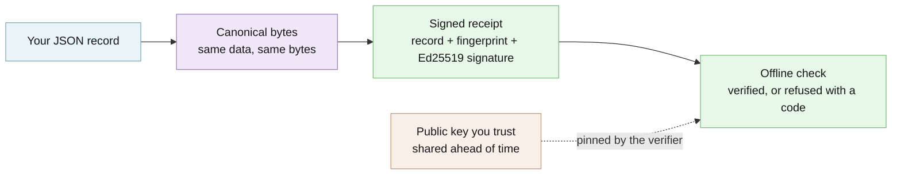

# Avow

Seals a record into a signed receipt anyone can check offline — for teams that must later prove it was not changed.

[](https://github.com/hseshadr/avow/actions/workflows/ci.yml)
[](LICENSE)

[Docs](docs/OPERATIONS.md) · [Quickstart](QUICKSTART.md)

```text
input:  the record {"service": "checkout-api", "decision": "approved"}
        and a private signing key that stays with you

output: original: {'service': 'checkout-api', 'decision': 'approved'} -> verified
        altered:  {'service': 'checkout-api', 'decision': 'rejected'} -> refused: avow.payload_hash_mismatch
```
<sub>Real output of the example below.</sub>

## At a glance

- **What it does** — Like a notary's stamp on a document, but for any JSON record
  (the plain text format most software exchanges data in): Avow turns the record into
  a signed receipt, and anyone holding your public checking key can later confirm, with
  no internet and no server, that the record is exactly what you signed. Change one
  word and the check refuses it.
- **Who it's for** — A team that has to show later what it decided or shipped — "this
  release was approved, with these checks passed" — to an auditor, a customer, or its own
  future self, without running a service or trusting a third party to hold the proof.
- **What stays on your device / what leaves it** — Stays: everything. Signing and
  checking are local file and math operations; Avow's code opens no network connection
  (the example below is tested with network access switched off). Leaves: only what you
  choose to send — and a receipt carries the record in plain, readable text, so do not
  put secrets in it.
- **Runs on** — Python 3.12 or newer on any operating system, or Node.js 22.13 or newer
  for the TypeScript package.
- **Not for** — Hiding data (a receipt is not encrypted) or proving a record is true,
  fresh, or fair; Avow proves only that it is unchanged and who signed it. Also not a
  defence against someone presenting the same valid receipt twice.
- **Status** — Beta: no version of this repository has been tagged or published yet;
  the source is the unpublished `0.5.0.dev0` / `0.5.0-dev.0` candidate. The `avow` and
  `@edgeproc/avow` 0.4.1 packages on PyPI and npm predate this repository. See
  [CHANGELOG](CHANGELOG.md).

## Try it in 60 seconds

Needs Python 3.12 or newer and [`uv`](https://docs.astral.sh/uv/).

```bash
git clone https://github.com/hseshadr/avow.git && cd avow && uv sync
```

Save this as `seal.py` in the checkout and run `uv run python seal.py`:

```python
from avow import generate_signing_key, public_key_hex, sign_payload, verify_receipt
from avow.errors import AvowError

private_key = generate_signing_key()      # stays with whoever signs
public_key = public_key_hex(private_key)  # handed to whoever checks, ahead of time
receipt = sign_payload({"service": "checkout-api", "decision": "approved"}, private_key)
verify_receipt(receipt, expected_public_key=public_key)
print("original:", receipt.payload, "-> verified")

altered = receipt.model_copy(update={"payload": {"service": "checkout-api", "decision": "rejected"}})
try:
    verify_receipt(altered, expected_public_key=public_key)
except AvowError as error:
    print("altered: ", altered.payload, "-> refused:", error.code)
```

Its real output:

```text
original: {'service': 'checkout-api', 'decision': 'approved'} -> verified
altered:  {'service': 'checkout-api', 'decision': 'rejected'} -> refused: avow.payload_hash_mismatch
```

The first check passes because the record is exactly what was signed. The second is
refused with a stable error code because one word of the record changed after signing.

More runnable examples: [`examples/`](examples/).

<!-- ======================== BELOW THE FOLD ======================== -->

## How it works

You give Avow a JSON record and a private signing key. It writes the record in one
canonical byte form (RFC 8785, so the same data always produces the same bytes), takes
its SHA-256 fingerprint, and signs those bytes with Ed25519. The receipt holds the record,
the fingerprint, the signer's public key, and the signature. A verifier recomputes the
fingerprint, requires the signer to be the public key it was given separately (never the
one inside the receipt), and checks the signature — all offline.



**[Explore the interactive architecture map →](docs/architecture/index.html)**
(Archify, generated from [`docs/architecture/runtime.architecture.json`](docs/architecture/runtime.architecture.json)).
Deep dive: [docs/OPERATIONS.md](docs/OPERATIONS.md).

### Package surfaces

Avow has two production package surfaces and no hidden third core:

```text
src/avow/  → Python wheel: avow/
ts/src/    → npm tarball: dist/
```

The Python wheel owns canonical JSON, hashes, Ed25519 key handling, receipts, the
`avow` command, and the append-only ledger. The npm package `@edgeproc/avow` owns the
portable TypeScript canonicalization and receipt surface; it does not ship the Python
ledger. Contract tests build both artifacts and check this mapping against their real
contents.

The cores do not interpret the evidence they seal. Domain calculations and
action-policy logic belong to their applications, not to Avow.

## What you can do

- Create a signing key pair and seal any JSON record into a receipt —
  [Quickstart](QUICKSTART.md#use-the-cli-directly)
- Verify a receipt offline against a public key you pinned —
  [Trust anchors](docs/OPERATIONS.md#trust-anchors)
- Chain receipts into an append-only ledger that detects deletion, insertion,
  reordering, and truncation — [Ledger recovery](docs/OPERATIONS.md#ledger-recovery)
- Sign and verify the same receipt format from TypeScript, held to Python by shared test
  vectors — [TypeScript package](ts/README.md)
- Branch on stable error codes instead of messages —
  [Stable command boundary](docs/OPERATIONS.md#stable-command-boundary)

## Why this and not X

| Alternative | Better when | Avow is better when |
|---|---|---|
| A plain hash or checksum | You only need to spot accidental corruption. | You must also prove *who* sealed the record. |
| GPG, minisign, or `ssh-keygen -Y sign` over a file | You sign files for people who already use those tools. | The thing you seal is structured data that different programs re-serialize: canonical JSON keeps the check stable, and Python and TypeScript share one receipt format. |
| Sigstore or a transparency log | You want public, time-stamped, third-party-witnessed signing of software releases. | You want no account, online signing service, or public log — only a key pair and files you control. |
| JWS / JWT libraries | You need standard web tokens for login or APIs. | You want a small, fixed receipt format with the evidence kept inside, verified against a key pinned out of band. |
| A database audit table | Everyone who checks can query your database. | The proof has to travel to someone who cannot reach, or should not have to trust, your systems. |

## Security and trust model

- **Verified:** that the record's canonical SHA-256 fingerprint matches its content, that
  the signer is the public key the verifier supplied independently, and that the Ed25519
  signature is valid. A ledger additionally verifies every entry, its order and links,
  and a final head you pinned somewhere the writer cannot rewrite.
- **Refuses rather than warns:** any mismatch — altered record, wrong signer, bad
  signature, unknown receipt schema — raises a typed error with a stable `avow.*` code
  and never returns a partial result. `avow sign` refuses a private key file that other
  users can read (`avow.key_permissions_insecure`), and a ledger whose head was not
  installed stops with `avow.ledger_recovery_required`.
- **Not protected:** the truth or freshness of the record; replay of a valid receipt;
  confidentiality (the record is plain text); a private key someone else has read — it is
  an unencrypted seed guarded only by file permissions; and a ledger plus its head file
  both rewritten by an attacker, unless you pinned the head elsewhere.
- **Verify a release:** this repository has not published a release yet, so build from a
  commit you have reviewed (`uv build`, then `pnpm --dir ts build` and
  `pnpm --dir ts pack`). The release workflow
  publishes with PyPI and npm provenance, and refuses when registry bytes differ from the
  reviewed build.

See [SECURITY.md](SECURITY.md) for reporting a vulnerability.

## What this proves / what it does not prove

### Run the evidence loop

From the checkout, run the complete evidence loop on a realistic deployment decision:

```bash
bash examples/run_evidence_loop.sh
```

Expected output:

```text
Receipt schema: avow.receipt/v1
Original receipt: avow.verify.ok
Altered receipt: avow.payload_hash_mismatch (expected)
```

The schema line names the exact receipt envelope Avow emitted and verified. The next
line means the payload hash, pinned signer, and signature all matched. The final line
is an expected rejection: the demo changed the deployment outcome inside a copy of the
receipt, so its stored hash no longer matched its payload.

[`examples/evidence.json`](examples/evidence.json) records a deployment decision with
an artifact digest, policy identity, environment, and completed checks. The script:

1. generates a local Ed25519 key pair;
2. signs that JSON into a self-contained receipt;
3. verifies the receipt against the separately pinned public key;
4. changes only the copied receipt's deployment outcome; and
5. requires the altered copy to fail with `avow.payload_hash_mismatch`.

The script creates a temporary directory and removes it on exit. Set `AVOW_DEMO_DIR`
to an empty directory if you want to inspect `receipt.json`,
`altered-receipt.json`, and the generated keys afterward.

### What this proves

`avow.verify.ok` proves that the evidence is unchanged from the bytes Avow sealed,
that the embedded signer matches the public key the verifier supplied independently,
and that the Ed25519 signature is valid for that evidence. Verification runs locally;
the runtime makes no network request.

A Python ledger can additionally prove that every retained receipt is valid, ordered,
linked, and ends at an externally pinned head. See [operations](docs/OPERATIONS.md).

The claims are backed by `uv run poe gate` (lint, strict types, Grade A complexity, and
the Python tests at 90% branch coverage or more), `pnpm --dir ts gate` (Biome, strict
TypeScript, coverage, build, and benchmark), the shared Python/TypeScript vectors in
`testdata/`, and the tamper and mutation jobs in CI.

### What this does not prove

A valid receipt does not prove that the evidence is correct, complete, fair, current,
or honest. It does not prove wall-clock time or prevent a valid receipt from being
presented again. A neighboring ledger-head file is only a convenience copy, not an
independent trust anchor. Receipts contain their JSON payload in cleartext; signing is
not encryption or redaction.

- **Not a replay defence.** A valid receipt verifies identically every time it is
  presented; Avow keeps no nonce, audience, or expiry state. Callers that need replay
  protection put those claims inside their own signed payload and check them after
  verification — see [replay protection is caller-owned](docs/OPERATIONS.md#replay-protection-is-caller-owned).
- **The signing key is an unencrypted seed.** The private key is a plaintext 32-byte
  Ed25519 seed protected only by filesystem permissions (owner-only `0600`). On POSIX
  systems `load_signing_key` refuses a key file that group or other can access, with
  `avow.key_permissions_insecure`. There is no KMS/HSM seam yet: anyone who can read the
  file can sign as you. See [key rotation](docs/OPERATIONS.md#key-rotation).

## Install

Prerequisites: Bash, Python 3.12 or newer, and [`uv`](https://docs.astral.sh/uv/).

This checkout contains the source; it is not a published or installed artifact.
Prepare its local environment with:

```bash
uv sync
```

Beside this repository's `pyproject.toml`, the demo deliberately selects the checkout's
`uv run ... avow` path before any installed `avow` on `PATH`, so it exercises this
source checkout. When only `examples/` is copied away, it uses the installed command
instead. To prove that packaged path, build and install the wheel as shown in the
[quickstart](QUICKSTART.md).

### Version and publication status

The Python source version is `0.5.0.dev0`; the npm source version is its SemVer spelling,
`0.5.0-dev.0`. Both are local split candidates and are not published. The published
`avow` `0.4.1` remains untouched. The published `@edgeproc/avow` `0.4.1` also remains
untouched. No command in this README publishes, tags, or changes either registry release.

## Usage & API

- **Python library** — `sign_payload`, `verify_receipt`, the key helpers, and the ledger
  functions are exported from `avow`; the example above is the smallest complete use.
- **Command line** — `avow keygen`, `avow sign`, `avow verify`, `avow ledger append`, and
  `avow ledger verify`, each printing a stable success or error code; see the
  [quickstart](QUICKSTART.md#use-the-cli-directly).
- **TypeScript** — `signPayload` and `verifySignature` from `@edgeproc/avow`; see the
  [TypeScript package](ts/README.md).

The JSON values Avow accepts, and why integers stay within ±(2^53 − 1), are listed in
[supported JSON values](QUICKSTART.md#supported-json-values).

## Configuration

Avow has no configuration file and reads no environment variables. Everything is passed
explicitly: the record, the private key file (or, in TypeScript, the caller-held seed), and
the public key and ledger head the verifier pins. Private key files (`*.key`) are
gitignored here and must never be committed; share only the `.pub` file.

## Limitations & roadmap

**Shipped:** in source only — no tagged release of this repository yet. The source
includes Python and TypeScript receipts, the Python `avow` command, the Python ledger,
and the refusal of group- or other-readable key files.

**Planned (not shipped):** a first tagged, published release of the `0.5.0` candidates,
which needs explicit maintainer approval.

**Not shipped:** a KMS/HSM seam for signing keys — none exists yet. Replay protection
stays caller-owned by design; see
[replay protection is caller-owned](docs/OPERATIONS.md#replay-protection-is-caller-owned).

## Getting help

- **GitHub Issues** — Best for: bugs and concrete feature requests.
- **Email (private)** — Best for: security reports; see [SECURITY.md](SECURITY.md).
  Never use a public issue for a vulnerability.

## Contributing / development

CI runs these two gates on every pull request, plus vector-parity, tamper, example, and
artifact jobs:

```bash
uv run poe gate && pnpm --dir ts gate
```

Further reading: [Quickstart](QUICKSTART.md), [Operations](docs/OPERATIONS.md),
[TypeScript package](ts/README.md), and [Provenance](PROVENANCE.md) for repository and
release identity.

### Maintainer release gate

The end-user demo above needs only Bash, Python 3.12 or newer, and `uv`. Contributors
running the complete release gate additionally need Node 22, Corepack, pnpm 11.5.0,
actionlint, gitleaks, and ShellCheck. Corepack selects the pinned pnpm version from
`ts/package.json`.

```bash
node --version
pnpm --version
uv run poe release-candidate
```

The gate rejects any active Node major other than 22 before installing dependencies.

## License / Citation

MIT — see [LICENSE](LICENSE).
