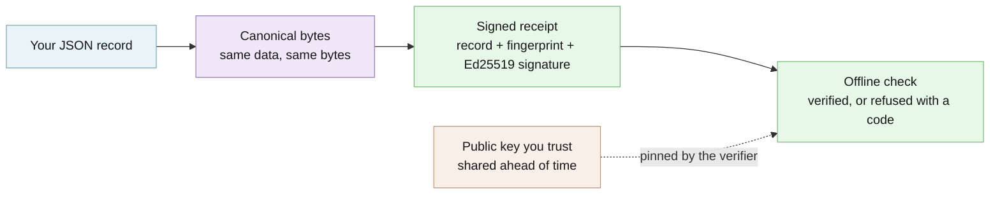

# Avow architecture

## TL;DR

Avow writes a JSON record in one fixed byte form, fingerprints it with SHA-256, and signs
it with Ed25519. The result is a receipt. A verifier checks the receipt offline against a
public key it got some other way, never the one inside the receipt. An optional ledger
chains receipts so a deleted, inserted, reordered, or truncated entry is caught.

## How signing and checking work

You give Avow a JSON record and a private signing key. It writes the record in one
canonical byte form (RFC 8785, so the same data always produces the same bytes), takes
its SHA-256 fingerprint, and signs those bytes with Ed25519. The receipt holds the record,
the fingerprint, the signer's public key, and the signature. A verifier recomputes the
fingerprint, requires the signer to be the public key it was given separately (never the
one inside the receipt), and checks the signature, all offline.



[Explore the interactive architecture map](architecture/index.html), generated with
Archify from [`architecture/runtime.architecture.json`](architecture/runtime.architecture.json).

A receipt on disk looks like this (`avow.receipt/v1`):

```json
{
    "payload": {"approved_by": "dana", "release": "checkout-api 2.4.1", "tests_passed": true},
    "payload_hash": "sha256:64a2594744910b829fe6f712750b05f87e08313a5f98af6ce2d170116d2a3fc5",
    "public_key": "<64 hex characters: the signer's Ed25519 public key>",
    "schema": "avow.receipt/v1",
    "signature": "<128 hex characters: the Ed25519 signature>"
}
```

## Package surfaces

Avow has two package surfaces and no hidden third core:

```text
src/avow/  → Python wheel: avow/
ts/src/    → npm tarball: dist/
```

The Python wheel owns canonical JSON, hashes, Ed25519 key handling, receipts, the
`avow` command, and the append-only ledger. The npm package `@edgeproc/avow` owns the
portable TypeScript canonicalization and receipt code; it does not ship the Python
ledger. Contract tests build both artifacts and check this mapping against their real
contents.

The cores do not interpret the evidence they seal. Domain calculations and
action-policy logic belong to their applications, not to Avow.

| Python module | What it does |
| --- | --- |
| `src/avow/canonical.py` | RFC 8785 canonical JSON and the accepted JSON value domain |
| `src/avow/keys.py` | Ed25519 key generation, loading (with the permission check), and saving |
| `src/avow/envelope.py` | The `avow.receipt/v1` receipt model and signing |
| `src/avow/verify.py` | Receipt verification against a pinned public key |
| `src/avow/ledger.py` | The append-only JSONL ledger and its head file |
| `src/avow/cli.py` | The `avow` command and its stable output codes |
| `src/avow/errors.py` | Typed errors, each with a stable `avow.*` code |

## What you can do

- Create a signing key pair and seal any JSON record into a receipt:
  [Quickstart](../QUICKSTART.md#use-the-cli-directly).
- Verify a receipt offline against a public key you pinned:
  [Trust anchors](OPERATIONS.md#trust-anchors).
- Chain receipts into an append-only ledger that detects deletion, insertion,
  reordering, and truncation: [Ledger recovery](OPERATIONS.md#ledger-recovery).
- Sign and verify the same receipt format from TypeScript, held to Python by shared test
  vectors in `testdata/`: [TypeScript package](../ts/README.md).
- Branch on stable error codes instead of messages:
  [Stable command boundary](OPERATIONS.md#stable-command-boundary).

## Usage and API

- **Python library:** `sign_payload`, `verify_receipt`, the key helpers, and the ledger
  functions are exported from `avow`.
- **Command line:** `avow keygen`, `avow sign`, `avow verify`, `avow ledger append`, and
  `avow ledger verify`, each printing a stable success or error code; see the
  [quickstart](../QUICKSTART.md#use-the-cli-directly). Success codes go to standard
  output; error codes go to standard error, with exit code `2` (or `3` for
  `avow.ledger_recovery_required`).
- **TypeScript:** `signPayload` and `verifySignature` from `@edgeproc/avow`; see the
  [TypeScript package](../ts/README.md).

The JSON values Avow accepts, and why integers stay within ±(2^53 − 1), are listed in
[supported JSON values](../QUICKSTART.md#supported-json-values).

## Configuration

Avow has no configuration file and reads no environment variables. Everything is passed
explicitly: the record, the private key file (or, in TypeScript, the caller-held seed), and
the public key and ledger head the verifier pins. Private key files (`*.key`) are
gitignored here and must never be committed; share only the `.pub` file.

## Compared with other tools

| Alternative | Better when | Avow is better when |
|---|---|---|
| A plain hash or checksum | You only need to spot accidental corruption. | You must also prove *who* sealed the record. |
| GPG, minisign, or `ssh-keygen -Y sign` over a file | You sign files for people who already use those tools. | The thing you seal is structured data that different programs re-serialize: canonical JSON keeps the check stable, and Python and TypeScript share one receipt format. |
| Sigstore or a transparency log | You want public, time-stamped, third-party-witnessed signing of software releases. | You want no account, online signing service, or public log: only a key pair and files you control. |
| JWS / JWT libraries | You need standard web tokens for login or APIs. | You want a small, fixed receipt format with the evidence kept inside, verified against a key pinned out of band. |
| A database audit table | Everyone who checks can query your database. | The proof has to travel to someone who cannot reach, or should not have to trust, your systems. |

## Security and trust model

- **Verified:** that the record's canonical SHA-256 fingerprint matches its content, that
  the signer is the public key the verifier supplied independently, and that the Ed25519
  signature is valid. A ledger additionally verifies every entry, its order and links,
  and a final head you pinned somewhere the writer cannot rewrite.
- **Refuses rather than warns:** any mismatch (altered record, wrong signer, bad
  signature, unknown receipt schema) raises a typed error with a stable `avow.*` code
  and never returns a partial result. `avow sign` refuses a private key file that other
  users can read (`avow.key_permissions_insecure`), and a ledger whose head was not
  installed stops with `avow.ledger_recovery_required`.
- **Not protected:** the truth or freshness of the record; replay of a valid receipt;
  confidentiality (the record is plain text); a private key someone else has read (it is
  an unencrypted seed guarded only by file permissions); and a ledger plus its head file
  both rewritten by an attacker, unless you pinned the head elsewhere.
- **Verify a release:** check the PyPI and npm provenance attestations for `0.5.0`, or
  build from a commit you have reviewed (`uv build`, then `pnpm --dir ts build` and
  `pnpm --dir ts pack`) and compare. The release workflow publishes with PyPI and npm
  provenance, and refuses when registry bytes differ from the reviewed build.

See [SECURITY.md](../SECURITY.md) for reporting a vulnerability.

## The evidence loop example

From a checkout, `bash examples/run_evidence_loop.sh` runs the whole cycle on a
realistic deployment decision and prints:

```text
Receipt schema: avow.receipt/v1
Original receipt: avow.verify.ok
Altered receipt: avow.payload_hash_mismatch (expected)
```

The schema line names the exact receipt envelope Avow emitted and verified. The next
line means the payload hash, pinned signer, and signature all matched. The final line
is an expected rejection: the demo changed the deployment outcome inside a copy of the
receipt, so its stored hash no longer matched its payload.

[`examples/evidence.json`](../examples/evidence.json) records a deployment decision with
an artifact digest, policy identity, environment, and completed checks. The script:

1. generates a local Ed25519 key pair;
2. signs that JSON into a self-contained receipt;
3. verifies the receipt against the separately pinned public key;
4. changes only the copied receipt's deployment outcome; and
5. requires the altered copy to fail with `avow.payload_hash_mismatch`.

The script creates a temporary directory and removes it on exit. Set `AVOW_DEMO_DIR`
to an empty directory if you want to inspect `receipt.json`, `altered-receipt.json`,
and the generated keys afterward. How it picks which `avow` to run is described in
[Getting started](GETTING_STARTED.md#run-the-demo).

## What this proves

`avow.verify.ok` proves that the evidence is unchanged from the bytes Avow sealed,
that the embedded signer matches the public key the verifier supplied independently,
and that the Ed25519 signature is valid for that evidence. Verification runs locally;
the runtime makes no network request.

A Python ledger can additionally prove that every retained receipt is valid, ordered,
linked, and ends at an externally pinned head. See [operations](OPERATIONS.md).

These claims are backed by `uv run poe gate` (lint, strict types, Grade A complexity, and
the Python tests at 90% branch coverage or more), `pnpm --dir ts gate` (Biome, strict
TypeScript, coverage, build, and benchmark), the shared Python/TypeScript vectors in
`testdata/`, and the tamper and mutation jobs in CI.

## What this does not prove

A valid receipt does not prove that the evidence is correct, complete, fair, current,
or honest. It does not prove wall-clock time or prevent a valid receipt from being
presented again. A neighboring ledger-head file is only a convenience copy, not an
independent trust anchor. Receipts contain their JSON payload in cleartext; signing is
not encryption or redaction.

- **Not a replay defence.** A valid receipt verifies identically every time it is
  presented; Avow keeps no nonce, audience, or expiry state. Callers that need replay
  protection put those claims inside their own signed payload and check them after
  verification. See [replay protection is caller-owned](OPERATIONS.md#replay-protection-is-caller-owned).
- **The signing key is an unencrypted seed.** The private key is a plaintext 32-byte
  Ed25519 seed protected only by filesystem permissions (owner-only `0600`). On POSIX
  systems `load_signing_key` refuses a key file that group or other can access, with
  `avow.key_permissions_insecure`. There is no KMS or HSM support yet: anyone who can
  read the file can sign as you. See [key rotation](OPERATIONS.md#key-rotation).

## Versions and publication

The Python and npm source versions are both `0.5.0`, the first release built from this
repository. Pushing the exact tag `v0.5.0` is the only thing that publishes them, through
the trusted-publishing workflow. Python releases `0.1.0` through `0.4.1` were built from
the pre-split repository and shipped top-level `assay/` and `writ/` packages that
overwrote `assay-engine`; they will be yanked once `0.5.0` is verified on PyPI. If an
older `avow` removed `assay-engine`'s files, run
`pip uninstall assay-engine && pip install assay-engine`. Where this repository came from
is recorded in [PROVENANCE.md](../PROVENANCE.md).

## Limits and roadmap

**Shipped:** `0.5.0`, with Python and TypeScript receipts, the Python `avow` command, the
Python ledger, and the refusal of group- or other-readable key files.

**Planned (not shipped):** yanking the broken `0.1.0`–`0.4.1` Python releases once
`0.5.0` is verified on PyPI.

**Not shipped:** KMS or HSM support for signing keys. Replay protection stays with the
caller by design; see
[replay protection is caller-owned](OPERATIONS.md#replay-protection-is-caller-owned).
